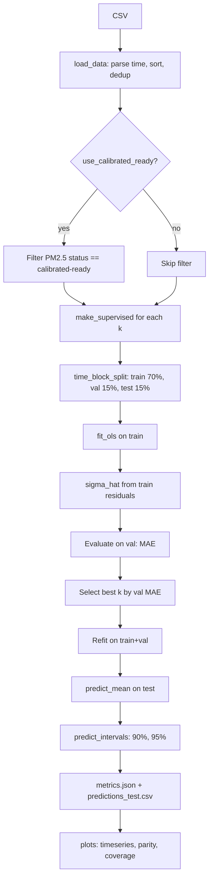
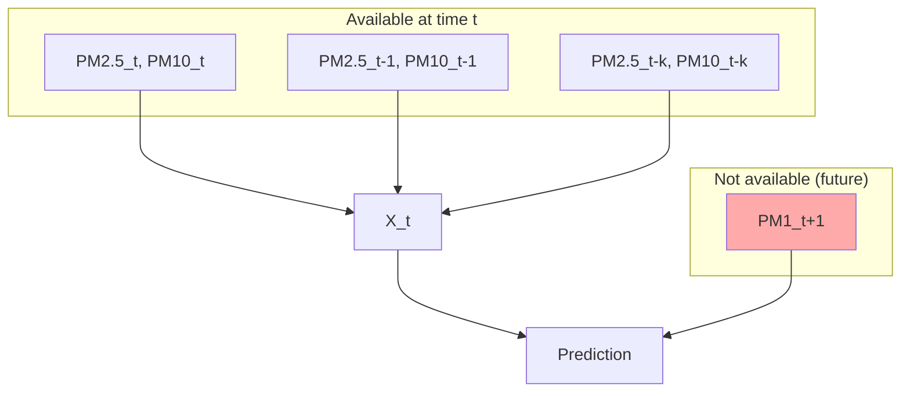

# PM1 Forecast Report (CS109)

## Problem Statement (Random Variables + Forecasting Target)

Let \(Y_t\) denote the PM1 mass concentration (1-hour mean, raw) at hour \(t\), and \(X_t^{(25)}, X_t^{(10)}\) the PM2.5 and PM10 concentrations at hour \(t\). The forecasting target is \(Y_{t+1}\)—PM1 one hour ahead—using only information available up to and including time \(t\). This is a regression problem in a time-series setting: predict the future value of \(Y\) given lagged values of PM2.5 and PM10.

## Data and Column Choices (Reproducibility)

We use exactly the following columns from the CSV:

- **Time index:** `Start of Period` (parsed as UTC datetime)
- **Target:** `PM1 mass concentration, 1-hour mean raw`
- **Predictors:** `PM2.5 mass concentration, 1-hour mean raw`, `PM10 mass concentration, 1-hour mean raw`
- **Optional filter:** `PM2.5 mass concentration, 1-hour mean status` == `calibrated-ready` (CLI flag `--use_calibrated_ready`, default off)

All other columns are ignored. This ensures full reproducibility given the same CSV.

## Time Ordering and Leakage Prevention

We maintain strict temporal ordering:

1. Parse and sort by `Start of Period` ascending.
2. Drop duplicate timestamps (keep first).
3. Feature construction uses only past and present: at time \(t\), features include PM2.5 and PM10 at \(t, t-1, t-3, t-6, t-12\) (depending on lag depth \(k\)). The label is \(Y_{t+1}\), which is in the future relative to all features. There is no use of future information in \(X_t\).

## From Time Series to Supervised Samples (Construction of \(X_t\) and \(Y_{t+1}\))

For lag depth \(k \in \{0, 1, 3, 6, 12\}\), we define:

- **Feature vector \(X_t\):** For each lag \(j \in \{0, 1, \ldots, k\}\) (using only lags that exist in the candidate set), we include \(\text{PM2.5}_{t-j}\) and \(\text{PM10}_{t-j}\). Example for \(k=1\): \(X_t = (\text{PM2.5}_t, \text{PM10}_t, \text{PM2.5}_{t-1}, \text{PM10}_{t-1})\).
- **Label:** \(Y_{t+1} = \text{PM1}_{t+1}\) (shifted by horizon \(h=1\)).

Rows with any NaN in features or label are dropped. The resulting supervised table is aligned in time.

## Train/Validation/Test Split (Contiguous Blocks)

Data are split by contiguous time blocks—no shuffling:

- **Train:** first 70%
- **Validation:** next 15%
- **Test:** last 15%

This preserves temporal ordering and avoids leakage across splits.

## Baselines (k=0 linear, and persistence as sanity check)

- **k=0 linear:** Uses only current PM2.5 and PM10 to predict PM1 at \(t+1\). This is the simplest linear model.
- **Persistence:** Using current PM1 as the forecast for next hour is a natural baseline; we do not implement it but conceptually it would serve as a sanity check (our model should beat naive persistence if lagged PM2.5/PM10 add information).

## Probabilistic Model Assumption (Linear + Gaussian Noise)

We assume:

\[
Y_{t+1} \mid X_t \sim \mathcal{N}(\mu_t, \sigma^2), \quad \mu_t = \beta_0 + \beta^\top X_t
\]

That is, the conditional distribution of PM1 given features is Normal with a linear mean and constant variance \(\sigma^2\).

## MLE → Least Squares (Conceptual explanation; no heavy derivation)

Under this Gaussian assumption, maximizing the likelihood over \((\beta_0, \beta, \sigma^2)\) yields:

- **Mean parameters:** \(\beta_0, \beta\) are estimated by ordinary least squares (OLS), i.e., minimizing \(\sum_i (y_i - \mu_i)^2\).
- **Variance:** \(\sigma^2\) is estimated from training residuals: \(\hat{\sigma}^2 = \frac{1}{n-p-1}\sum_i (y_i - \hat{\mu}_i)^2\), where \(p\) is the number of features.

sklearn’s `LinearRegression` provides the OLS estimates; we compute \(\hat{\sigma}\) from residuals with ddof=1.

## Model Selection Over Lag Depth \(k\) (Validation MAE)

We evaluate candidate \(k \in \{0, 1, 3, 6, 12\}\) by validation MAE. The \(k\) with the lowest validation MAE is selected. The model is then refit on train+validation (combined contiguous block) and evaluated on the held-out test set.

## Uncertainty Quantification (Normal predictive distribution, 90%/95% intervals)

The predictive distribution for a new \(X\) is \(\mathcal{N}(\hat{\mu}, \hat{\sigma}^2)\). Point prediction: \(\hat{\mu}\). Symmetric prediction intervals use Normal quantiles:

- 90%: \([\hat{\mu} - z_{0.95}\,\hat{\sigma},\, \hat{\mu} + z_{0.95}\,\hat{\sigma}]\)
- 95%: \([\hat{\mu} - z_{0.975}\,\hat{\sigma},\, \hat{\mu} + z_{0.975}\,\hat{\sigma}]\)

where \(z_\alpha\) is the \(\alpha\)-quantile of the standard Normal.

## Evaluation on Test (MAE/MSE + coverage)

On the test set we report:

- **MAE** and **MSE** for point predictions.
- **Empirical coverage** for 90% and 95% prediction intervals: fraction of test points whose true value falls within the interval.

## Results Artifacts (what files/figures are produced)

| Artifact | Description |
|----------|-------------|
| `outputs/metrics.json` | `best_k`, `test_mae`, `test_mse`, `coverage_90`, `coverage_95` |
| `outputs/best_model.json` | `intercept`, `coefficients`, `sigma_hat`, `k`, `feature_names` |
| `outputs/predictions_test.csv` | `timestamp`, `y_true`, `y_pred`, `lower_90`, `upper_90`, `lower_95`, `upper_95` |
| `outputs/figures/timeseries_week.png` | 7-day window: true vs predicted with 90% band |
| `outputs/figures/parity_plot.png` | True vs predicted scatter |
| `outputs/figures/interval_coverage.png` | Nominal vs empirical coverage bars |

## Limitations and CS109-Scope Extensions (brief)

- **Linear mean:** Real relationships may be nonlinear; extensions could use polynomial features or tree-based models.
- **Constant variance:** Heteroscedasticity could be modeled (e.g., predict log-variance).
- **Regularization:** MAP with a Gaussian prior on \(\beta\) leads to ridge regression; we use OLS for simplicity.
- **Other lags:** Only \(k \in \{0,1,3,6,12\}\) are tried; a finer grid or cross-validation over \(k\) could be explored.

---

## Pipeline Flow Diagram



## Model Diagram

```mermaid
flowchart LR
    X[X_t: PM2.5/PM10 lags] --> L[Linear mean beta^T X_t]
    L --> M[mu_t]
    M --> N[+ Gaussian noise N 0, sigma^2]
    N --> Y[Y_{t+1}]
```

## Data Leakage Diagram


